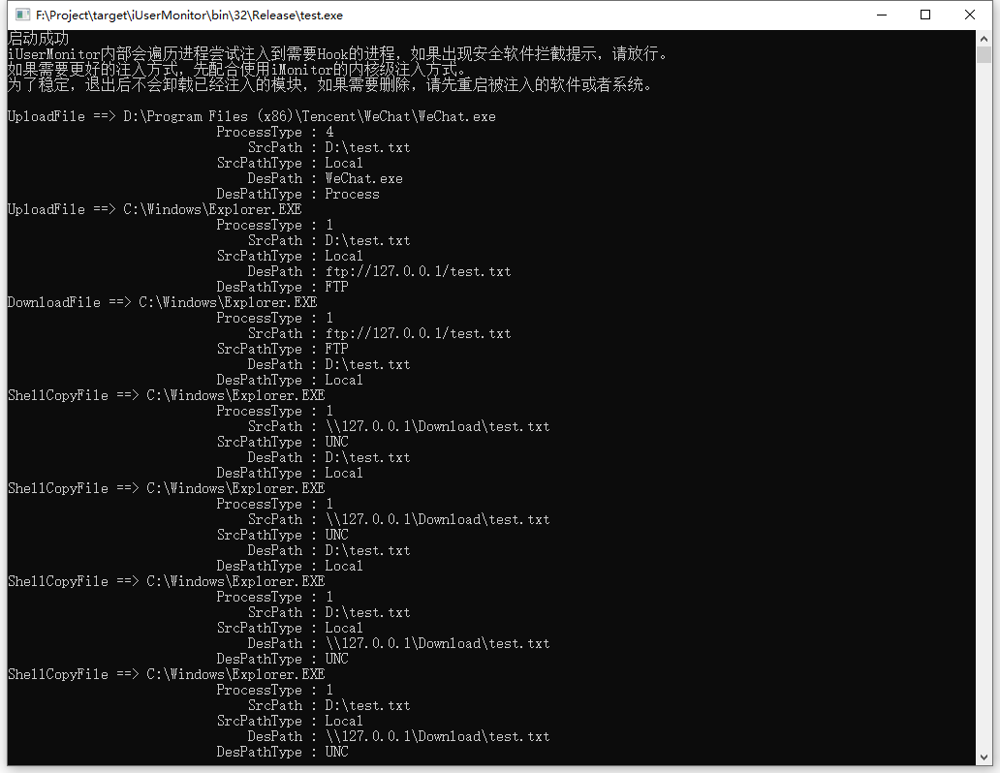

## 简介

iUserMonitorSDK是一款针对用户行为的监控的开发套件，是iMonitorSDK在应用层能力的补充。

使用iUserMonitorSDK可以实现驱动层没法监控到的一些用户行为。包括不限于文件的各种操作（包括拷贝、复制、下载、上传等，支持的渠道包括U盘、FTP、共享目录、IM、网盘等）、IM的聊天记录、邮件收发、文件打印等一些行为的监控。

### [接入文档](https://imonitorsdk.com/docs/i-user-monitor)

### 📦 适用于如下的产品

- DLP
- 终端审计
- EDR
- 用户行为管理
- 病毒链路追踪

## 🔨 快速入门

```c++
#include <iUserMonitorSDK.h>
#include <iUserMonitorProtocol.h>

class UserMontorCallback : public IUserMonitorCallback
{
public:
	void OnCallback(IUserMonitorMessage* msg)
	{
		printf("%S ==> %S\n", msg->GetTypeName(), msg->GetFormatedString(emMSGFieldCurrentProcessPath));
		printf("\t%30S : %-30d\n", _T("ProcessType"), msg->GetHeader()->CurrentProcessType);

		for (ULONG i = emMSGFieldPath; i < msg->GetFieldCount(); i++) {
			printf("\t%30S : %-30S\n", msg->GetFieldName(i), msg->GetFormatedString(i));
		}
	}
};

int main(int argc, char* argv[])
{
	UserMonitorManager mgr;
	UserMontorCallback callback;

	HRESULT hr = mgr.Start(&callback);

	if (hr != S_OK) {
		printf("start error = %08X", hr);
		return -1;
	}

	WaitForSingleObject(GetCurrentThread(), INFINITE);

	return 0;
}
```



## 版本

当前为演示版本，只包含了部分演示功能，同时用了加密壳，在某些环境可能存在兼容性问题，仅供测试，请勿用于生产环境！！！

[如需正式授权，或者其他的功能，请联系我们。](https://imonitorsdk.com/about)

